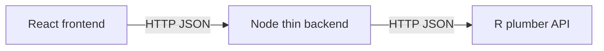

# Contributing to the backend (Node + R)

This backend is intentionally **thin**: it proxies requests from the React frontend to an R (plumber) API that hosts the actual models and data logic.

This document explains:

- how the pieces fit together
- what contracts the backend exposes
- how to extend the Node proxy and/or the R API safely

---

## 1. High‑level architecture

Backend components for this project:

- **React frontend** (in the repo root): calls `VITE_API_URL` (the Node backend) over HTTP.
- **Node “thin backend”** (`server/`): Express app that:
  - exposes `/api/*` endpoints to the frontend
  - forwards them to the R API at `R_API_URL`
  - handles basic error mapping and CORS
- **R API** (plumber, separate project/folder): implements the real endpoints (`/predict`, `/health`, …).

In basic terms:



---

## 2. Key environment variables

Node backend config lives in `server/.env` (see `.env.example` for defaults):

- **`PORT`**: port the Node server listens on (default `3001`).
- **`R_API_URL`**: base URL for the R API (default `http://localhost:8000`).

Frontend config (in the root app, not here):

- **`VITE_API_URL`**: base URL the React app uses for API calls. In dev, this should usually match the Node backend:

```bash
VITE_API_URL=http://localhost:3001
```

This creates a simple chain:

```text
React -> VITE_API_URL (Node) -> R_API_URL (plumber)
```

---

## 3. Existing endpoints and contracts

The main backend entry point is [`server/src/index.ts`](server/src/index.ts).

### 3.1 `/api/health`

```ts
app.get("/api/health", async (_req, res) => {
  try {
    const r = await fetch(`${R_API_URL}/health`);
    const data = await r.json();
    res.json(data);
  } catch (err) {
    res.status(502).json({ status: "error", message: "R API unreachable" });
  }
});
```

- **Frontend → Node**: `GET /api/health`
- **Node → R**: `GET {R_API_URL}/health`
- **Expected R behavior**:
  - respond with `200` and JSON describing health (e.g. `{ status: "ok" }`)
  - if the R API is down or times out, the Node layer returns:
    - `502` and `{ status: "error", message: "R API unreachable" }`

Use this endpoint to check that:

1. Node is running and reachable from the browser.
2. Node can successfully reach the R API.

### 3.2 `/api/predict`

```ts
app.post("/api/predict", async (req, res) => {
  try {
    const r = await fetch(`${R_API_URL}/predict`, {
      method: "POST",
      headers: { "Content-Type": "application/json" },
      body: JSON.stringify(req.body),
    });
    const data = await r.json();
    res.status(r.ok ? 200 : 502).json(data);
  } catch (err) {
    res.status(502).json({ error: "R API unreachable" });
  }
});
```

**Frontend contract** (see [`src/api/mlClient.ts`](../src/api/mlClient.ts)):

- Sends `POST {VITE_API_URL}/api/predict` with JSON body of type:

  ```ts
  export interface PredictRequest {
    [key: string]: unknown;
  }
  ```

- Expects JSON response of type:

  ```ts
  export interface PredictResponse {
    predictions?: number[];
    message?: string;
    [key: string]: unknown;
  }
  ```

**R API contract**:

- Endpoint: `POST {R_API_URL}/predict`
- Request:
  - `Content-Type: application/json`
  - Body is forwarded **as‑is** from the frontend.
- Response:
  - On success:
    - `200` and a JSON object compatible with `PredictResponse`
  - On validation/model error:
    - any non‑2xx status and a JSON body explaining the error
    - Node will turn this into a `502` to the frontend but keep the JSON body.

As you add more fields to the prediction API (e.g. confidence intervals, feature importances), keep the response JSON backwards compatible so the frontend does not break.

---

## 4. Local development workflow

For a full stack dev loop:

1. **Start the R API** (plumber)
   - Ensure it listens on the same host/port as `R_API_URL` (e.g. `http://localhost:8000`).
   - Implement at least `/health` and `/predict` as described above.

2. **Start the Node backend**

   ```bash
   cd server
   npm install
   # .env can override PORT and R_API_URL
   npm run dev
   ```

   By default this starts on `http://localhost:3001`.

3. **Start the React frontend**

   - In the root project, set `VITE_API_URL=http://localhost:3001`.
   - Run `npm run dev` (or equivalent).

4. **Verify the chain**
   - Hit `GET http://localhost:3001/api/health` in a browser or with `curl`.
   - Trigger `predict` from the UI or via `curl` to `POST /api/predict`.

---

## 5. Extending the backend

There are two main ways to extend backend capabilities:

1. **Add new endpoints to the R API and proxy them through Node** (preferred).
2. **Implement light logic or aggregation in Node** while still delegating heavy work to R.

### 5.1 Adding a new R endpoint and Node proxy

Let’s say you want a new feature: `/api/explain` to return model explanations.

**Step 1: Implement in R (plumber)**

- Add a new route in the R plumber API, e.g.:
  - `POST /explain`
  - Accepts JSON input similar to `/predict`
  - Returns JSON, e.g. `{ feature_importance: [...], message: "ok" }`

**Step 2: Add the Node proxy**

- In `server/src/index.ts`, add:

  ```ts
  app.post("/api/explain", async (req, res) => {
    try {
      const r = await fetch(`${R_API_URL}/explain`, {
        method: "POST",
        headers: { "Content-Type": "application/json" },
        body: JSON.stringify(req.body),
      });
      const data = await r.json();
      res.status(r.ok ? 200 : 502).json(data);
    } catch (err) {
      res.status(502).json({ error: "R API unreachable" });
    }
  });
  ```

- Keep error handling consistent with existing endpoints unless there is a strong reason to differ.

**Step 3: Add a typed client in the frontend**

- Mirror what `mlClient.ts` does: define `ExplainRequest`/`ExplainResponse` types and a small `explain()` helper that `fetch`es `VITE_API_URL + /api/explain`.

### 5.2 When to put logic in Node vs R

As a rule of thumb:

- **R (plumber)** is the source of truth for:
  - statistical / ML models
  - data access from R‑native libraries
  - domain‑specific calculations that already exist in R

- **Node** should:
  - expose a stable `/api/*` surface to the frontend
  - handle cross‑cutting concerns:
    - CORS
    - auth (if added later)
    - rate limiting
    - logging / tracing
  - perform **light transformation**:
    - input validation before forwarding to R
    - normalizing R responses into a stable JSON contract

Keep Node logic small and predictable so students can read and understand the flow quickly.

---

## 6. Error handling and logging guidelines

When adding new routes:

- **Return machine‑readable JSON** for all errors.
  - Example: `{ "error": "R API unreachable" }`, `{ "error": "invalid payload", "details": {...} }`.
- **Use `502` for upstream R failures** (R down, timeout, non‑JSON) to signal “bad gateway”.
- **Log enough context** (status code, endpoint, high‑level error) to debug, but avoid logging raw user data or secrets.

For the R API:

- Prefer explicit, structured error JSON (with `status`/`message` fields) instead of plain strings.
- Make sure every route either:
  - returns `2xx` on success, or
  - returns a non‑2xx status with a JSON body explaining the problem.

---

## 7. Style and code conventions

- **TypeScript only** in `server/src/`.
- Prefer **small, focused handlers** rather than large multi‑purpose ones.
- Keep **naming consistent** with the frontend:
  - If the React side calls `predict()`, the Node route should be `/api/predict`, and the R route `/predict`.
- When in doubt, copy the patterns used in the existing `/api/health` and `/api/predict` handlers.

If you’re unsure where a new feature should live (frontend vs Node vs R), open an issue or PR with a short proposal and we can decide together. 

