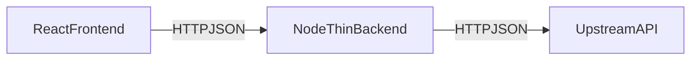

# Contributing to the backend

This backend is intentionally thin: it proxies requests from the React frontend to an upstream API that hosts model and data logic.

## 1. High-level architecture

Backend components for this project:

- React frontend (repo root): calls `VITE_API_URL` over HTTP.
- Node backend (`server/`): exposes `/api/*` routes to the frontend and forwards to `R_API_URL`.
- Upstream API (external service): implements `/health`, `/predict`, and any additional model/data endpoints.



## 2. Environment variables

Node backend config lives in `server/.env` (see `.env.example`):

- `PORT`: port the Node server listens on (default `3001`)
- `R_API_URL`: base URL for the upstream API (default `http://localhost:8000`)

Frontend config:

- `VITE_API_URL`: base URL the React app uses for backend calls (typically `http://localhost:3001` in dev)

## 3. Existing endpoints and contracts

Main entry point: `server/src/index.ts`.

- `GET /api/health`
  - Node forwards to `GET {R_API_URL}/health`.
  - If upstream is unreachable, Node returns `502` with JSON error.
- `POST /api/predict`
  - Node forwards JSON body to `POST {R_API_URL}/predict`.
  - Node forwards upstream JSON response and maps non-2xx/unreachable to `502`.

## 4. Local development workflow

1. Start the upstream API, ensuring `/health` and `/predict` are available.
2. Start this backend:

   ```bash
   cd server
   npm install
   npm run dev
   ```

3. Start the React app with `VITE_API_URL` pointing at this backend.
4. Verify chain by calling `GET http://localhost:3001/api/health` and `POST /api/predict`.

## 5. Extending backend routes

Preferred pattern: add the endpoint upstream first, then proxy it in `server/src/index.ts`.

Example for a new `/api/explain` route:

1. Upstream implements `POST /explain`.
2. Node adds `POST /api/explain` that forwards request/response JSON.
3. Frontend adds a typed client helper.

## 6. Error handling guidelines

- Return machine-readable JSON for all errors.
- Use `502` for upstream failures/timeouts/non-JSON errors.
- Keep logs high-signal and avoid sensitive payload details.

## 7. Style conventions

- TypeScript only in `server/src/`.
- Keep handlers small and focused.
- Keep route naming consistent across frontend, backend, and upstream API.
